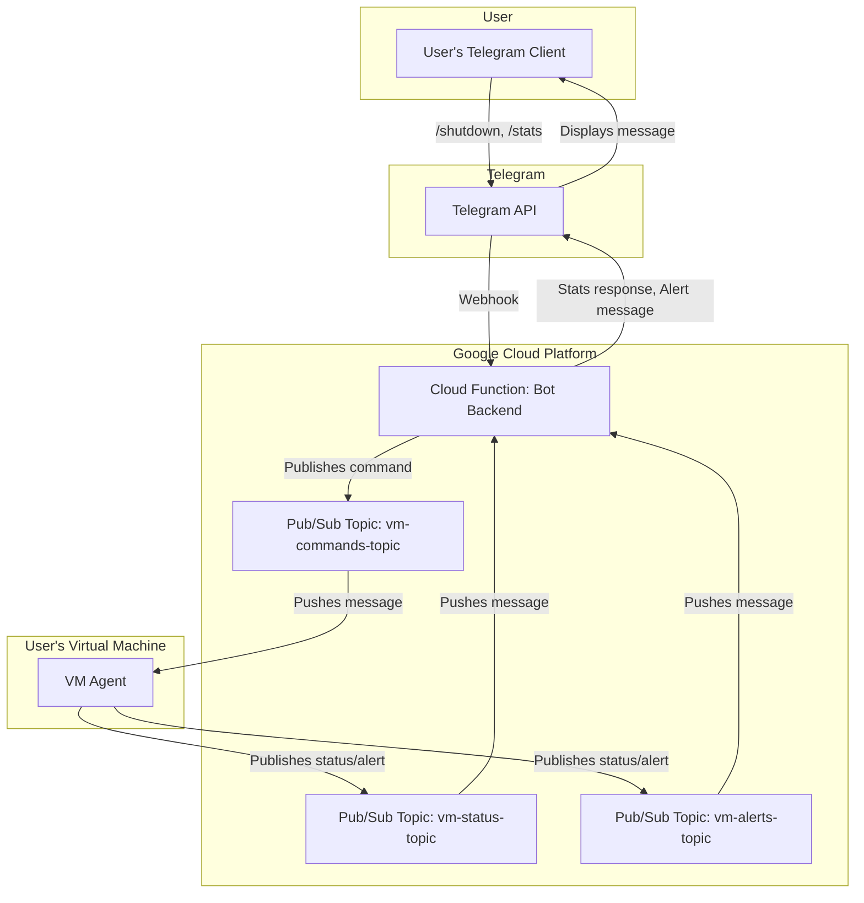
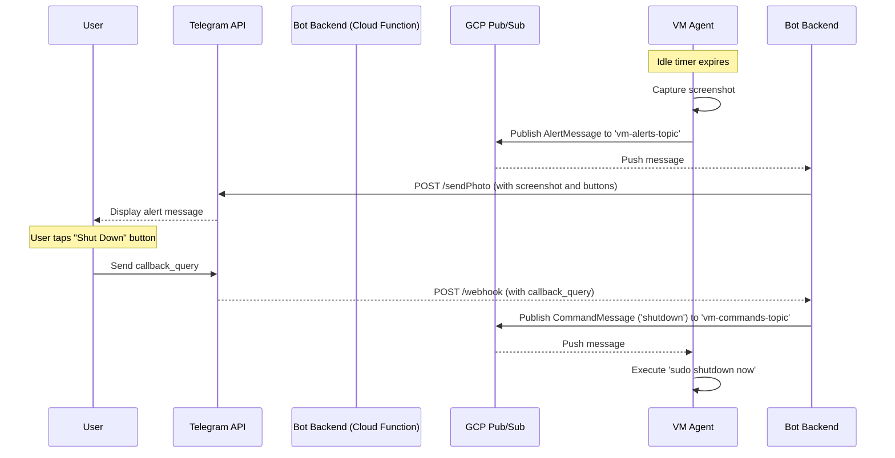
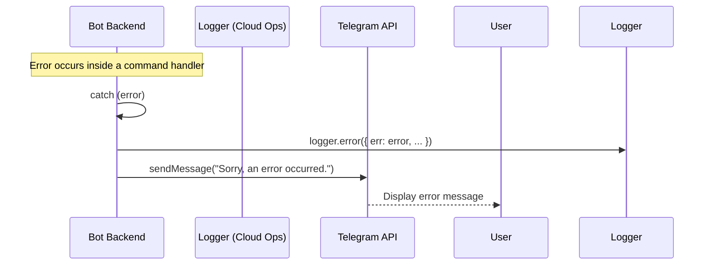

# VM Sentinel Fullstack Architecture Document

## Section 1: Introduction

This document outlines the complete full-stack architecture for VM Sentinel, including the backend systems (a VM agent and serverless functions) and the frontend implementation (a Telegram bot), detailing their integration. It serves as the single source of truth for AI-driven development, ensuring consistency across the entire technology stack.

This unified approach is tailored for a modern, decoupled application where the "frontend" is a conversational interface and the "backend" consists of both a device-local agent and cloud-based services.

## Section 2: High Level Architecture

#### Technical Summary
The architecture for VM Sentinel is a decoupled, event-driven system designed for security and minimal resource overhead. It consists of a Node.js **VM agent** running on the target Debian machine, which communicates asynchronously with a serverless **Telegram bot backend** via a **Google Cloud Pub/Sub** message bus. The backend, hosted on Google Cloud Functions, processes user commands and relays them securely to the agent. This design avoids exposing any inbound ports on the user's VM, directly achieving the core security and "effortless control" goals from the PRD.

#### Platform and Infrastructure Choice
**Platform:** Google Cloud Platform (GCP)
**Key Services:**
*   **Google Cloud Functions:** For hosting the serverless, stateless bot backend.
*   **Google Cloud Pub/Sub:** To act as the secure, asynchronous message bus between the agent and the bot.
*   **Google IAM:** For securely managing credentials for the VM agent.
**Deployment Host and Regions:** The Cloud Function will be deployed to a region like `us-central1` to start. This can be configured based on user location for lower latency if needed in the future.

#### Repository Structure
**Structure:** Monorepo
**Monorepo Tool:** npm Workspaces
**Package Organization:** The repository will contain an `packages` directory with two primary packages:
*   `packages/agent`: The Node.js application for the VM agent
*   `packages/bot`: The Node.js application for the Telegram bot backend (Cloud Function).
This aligns with PRD Story 1.1 and simplifies dependency management and code sharing.

#### High Level Architecture Diagram


#### Architectural Patterns
- **Serverless Architecture:** The bot backend is a serverless function, eliminating the need for server management and reducing cost. _Rationale:_ Aligns with the project's goal of being a lightweight, low-overhead utility.
- **Event-Driven Architecture:** Components communicate through events (messages) on the Pub/Sub bus, decoupling them completely. _Rationale:_ This is critical for security (no open ports) and resilience (components don't need to be online simultaneously).
- **Agent-Based Monitoring:** A local agent performs monitoring on the host system. _Rationale:_ This is the only way to get detailed, real-time system information like input device usage and screen content.
- **Message Bus Integration:** Using Pub/Sub as a central message broker. _Rationale:_ Provides a scalable, reliable, and secure communication channel that forms the backbone of the entire system.

## Section 3: Tech Stack

#### Technology Stack Table
| Category | Technology | Version | Purpose | Rationale |
| :--- | :--- | :--- | :--- | :--- |
| Frontend Language | Telegram UI | N/A | User Interface | The UI is rendered by the native Telegram client. |
| Frontend Framework | Telegram Bot API | N/A | UI Interaction | All user interactions are handled via bot commands and buttons. |
| UI Component Library | N/A | N/A | N/A | N/A |
| State Management | N/A | N/A | N/A | N/A |
| Backend Language | Node.js | 18.x LTS | Agent & Bot Runtime | Specified in PRD (NFR3) for its event-driven nature and large ecosystem. |
| Backend Framework | Express.js | 4.x | Bot Webhook Handler | Lightweight, unopinionated framework ideal for wrapping a simple Cloud Function. |
| API Style | Async Messaging | N/A | Decoupled Communication | Using Google Pub/Sub topics (`vm-status`, `vm-alerts`, `vm-commands`). |
| Database | Local CSV File | N/A | MVP Metric Storage | As per PRD (NFR4), avoids database setup overhead for the MVP. |
| Cache | N/A | N/A | N/A | No caching is required for the MVP's functionality. |
| File Storage | Local VM Filesystem | N/A | Screenshot/Log Storage | Screenshots and logs are stored on the VM before processing or cleanup. |
| Authentication | Telegram Chat ID | N/A | Secure User Validation | Simple, effective security model for a single-user tool, as per PRD (FR8). |
| Backend Testing | Jest | 29.x | Unit & Integration Tests | Popular, well-supported testing framework in the Node.js ecosystem. |
| E2E Testing | TBD | N/A | Full System Validation | Not in scope for MVP, but could be explored later if needed. |
| Build Tool | npm scripts | 9.x+ | Task Automation | Standard for Node.js projects to run build, test, and lint commands. |
| Bundler | esbuild | 0.19.x | Cloud Function Bundling | Extremely fast bundler to optimize the bot's cold start time and package size. |
| IaC Tool | Manual Setup | N/A | Infrastructure Provisioning | Initial setup will be manual via GCP Console, as per docs. Can be automated later. |
| CI/CD | GitHub Actions | N/A | Continuous Integration | Industry standard for automating testing and linting on each commit. |
| Monitoring | Google Cloud Ops | N/A | Backend Observability | Provides logging and metrics for Cloud Functions and Pub/Sub out-of-the-box. |
| Logging | pino | 8.x | Structured Logging | High-performance logger for creating structured, parseable logs. |
| CSS Framework | N/A | N/A | N/A | N/A |

## Section 4: Data Models

### Model: `AgentConfig`
**Purpose:** Defines the local configuration for the VM agent. This file is managed by the user and read by the agent on startup.

**Key Attributes:**
- `gcp_project_id`: `string` - The Google Cloud project ID.
- `gcp_keyfile_path`: `string` - Absolute path to the GCP service account key file.
- `telegram_authorized_chat_id`: `string` - The user's Telegram Chat ID to authorize commands.
- `monitoring_interval_ms`: `number` - How often to poll for system metrics.
- `idle_timeout_minutes`: `number` - Minutes of inactivity before triggering an idle alert.
- `screenshot_comparison_threshold`: `number` - The percentage of pixel difference required to register a screen change.

#### TypeScript Interface
```typescript
interface AgentConfig {
  gcp_project_id: string;
  gcp_keyfile_path: string;
  telegram_authorized_chat_id: string;
  monitoring_interval_ms: number;
  idle_timeout_minutes: number;
  screenshot_comparison_threshold: number;
}
```
#### Relationships
- This interface defines the structure of the `config.json` file read by the **VM Agent**.

### Model: `StatusMessage`
**Purpose:** Transports periodic system metrics from the agent to the cloud. This data is used for the `/stats` command.

**Key Attributes:**
- `timestamp`: `string` - ISO 8601 timestamp of when the metrics were captured.
- `cpu_usage`: `number` - Current CPU utilization percentage.
- `ram_usage`: `number` - Current RAM usage percentage.
- `last_input_timestamp`: `string` - ISO 8601 timestamp of the last detected user input.

#### TypeScript Interface
```typescript
interface StatusMessage {
  timestamp: string;
  cpu_usage: number;
  ram_usage: number;
  last_input_timestamp: string;
}
```
#### Relationships
- Published by the **VM Agent** to the `vm-status-topic`.
- Consumed by the **Bot Backend** to respond to the `/stats` command.

### Model: `AlertMessage`
**Purpose:** Notifies the bot that the VM has entered an idle state. It includes a screenshot for the user to have visual context.

**Key Attributes:**
- `timestamp`: `string` - ISO 8601 timestamp of when the idle state was confirmed.
- `screenshot_base64`: `string` - A base64-encoded string of the captured screenshot (JPEG or PNG).
- `cpu_usage`: `number` - CPU utilization at the time of the alert.
- `ram_usage`: `number` - RAM usage at the time of the alert.

#### TypeScript Interface
```typescript
interface AlertMessage {
  timestamp: string;
  screenshot_base64: string;
  cpu_usage: number;
  ram_usage: number;
}
```
#### Relationships
- Published by the **VM Agent** to the `vm-alerts-topic`.
- Consumed by the **Bot Backend** to generate and send the proactive alert to the user.

### Model: `CommandMessage`
**Purpose:** Sends control instructions from the bot back down to the agent on the VM.

**Key Attributes:**
- `command`: `'shutdown' | 'reset_idle_timer'` - A string literal defining the specific action for the agent to take.

#### TypeScript Interface
```typescript
interface CommandMessage {
  command: 'shutdown' | 'reset_idle_timer';
}
```
#### Relationships
- Published by the **Bot Backend** to the `vm-commands-topic`.
- Consumed by the **VM Agent** to execute the requested action (e.g., initiate shutdown).

## Section 5: API Specification

This project does not use a traditional synchronous API like REST or GraphQL. Instead, its "API" is defined by the combination of user-facing bot commands and the internal asynchronous message schemas used by Pub/Sub.

#### 1. User Command API (via Telegram)
This is the API exposed to the end-user through the Telegram bot interface.

**Commands:**
- `/start`: Displays a welcome message and lists available commands.
- `/help`: Same as `/start`.
- `/stats`: Requests the latest metrics from the VM. The bot will respond with the data from the most recent `StatusMessage`.
- `/shutdown`: Initiates the shutdown sequence for the VM.

**Callback Queries (Buttons):**
- `shutdown`: Sent when the user presses the "Shut Down" button on an idle alert. Triggers the same workflow as the `/shutdown` command.
- `ignore`: Sent when the user presses the "Ignore" button. The bot sends a `CommandMessage` with the `reset_idle_timer` command to the agent.

#### 2. Service-to-Service API (via Google Pub/Sub)
This is the internal API used for communication between the **VM Agent** and the **Bot Backend**. The specification for these API messages is defined by the TypeScript interfaces in the **Data Models** section above.

- **`StatusMessage`**: Sent from Agent to Bot.
- **`AlertMessage`**: Sent from Agent to Bot.
- **`CommandMessage`**: Sent from Bot to Agent.

## Section 6: Components

### Component: VM Agent
**Responsibility:** This is the core monitoring service that runs on the user's virtual machine. Its primary job is to watch for user activity, decide if the machine is idle, and execute commands sent from the user.

**Key Interfaces:**
- **Publishes to:** `vm-status-topic`, `vm-alerts-topic` (sending `StatusMessage` and `AlertMessage` models).
- **Subscribes to:** `vm-commands-topic` (receiving `CommandMessage` model).
- **Reads from:** Local `config.json` file for startup configuration.
- **Executes:** Local system commands (`shutdown`, `scrot`, `xinput`).

**Dependencies:** Google Cloud Pub/Sub, a Debian-based OS with XFCE, Node.js runtime.

**Technology Stack:** Node.js, pino (logging).

### Component: Bot Backend
**Responsibility:** This serverless function is the brain of the user-facing bot. It authenticates the user, interprets their commands, and acts as the bridge to the VM Agent via the Communication Bus.

**Key Interfaces:**
- **Receives:** HTTP POST requests from the Telegram Webhook API.
- **Sends to:** Telegram Bot API via HTTP to post messages and buttons to the user.
- **Subscribes to:** `vm-status-topic`, `vm-alerts-topic`.
- **Publishes to:** `vm-commands-topic`.

**Dependencies:** Telegram API, Google Cloud Pub/Sub.

**Technology Stack:** Node.js, Express.js, esbuild.

### Component: Communication Bus
**Responsibility:** This is not an application, but the central nervous system of the project. It consists of dedicated message topics that ensure secure and reliable asynchronous communication between the Agent and the Bot.

**Key Interfaces:**
- **`vm-status-topic`:** A channel for the agent to send routine metric updates.
- **`vm-alerts-topic`:** A high-priority channel for the agent to send critical idle alerts.
- **`vm-commands-topic`:** A channel for the bot to send commands down to the agent.

**Dependencies:** None. It is the central dependency for other components.

**Technology Stack:** Google Cloud Pub/Sub.

## Section 7: External APIs

This project integrates with two primary external APIs: Google Cloud Pub/Sub for messaging and the Telegram Bot API for user interaction.

### Google Cloud Pub/Sub API
- **Purpose:** Provides the secure and reliable asynchronous messaging backbone that connects the VM Agent and the Bot Backend.
- **Documentation:** [cloud.google.com/pubsub/docs/reference/libraries](https://cloud.google.com/pubsub/docs/reference/libraries)
- **Base URL(s):** `pubsub.googleapis.com`
- **Authentication:** A GCP Service Account key file (`.json`) is used by the VM Agent. The Bot Backend (Cloud Function) uses the intrinsic service account identity provided by the execution environment.
- **Rate Limits:** Extremely generous limits that are not a practical concern for this single-user application.

**Key Endpoints Used:**
This API is consumed via the `@google-cloud/pubsub` Node.js client library, not direct REST calls. The primary methods are:
- `topic.publishMessage()`: Used by both Agent and Bot to send messages.
- `subscription.on('message', ...)`: Used by both Agent and Bot to process incoming messages.

**Integration Notes:** The client library handles all the complexities of authentication, message batching, and retry logic.

### Telegram Bot API
- **Purpose:** Allows our Bot Backend to send messages to the user and receive their commands.
- **Documentation:** [core.telegram.org/bots/api](https://core.telegram.org/bots/api)
- **Base URL(s):** `api.telegram.org`
- **Authentication:** A secret Bot Token obtained from Telegram's "BotFather". This token is provided in the HTTP requests to the API.
- **Rate Limits:** The API has rate limits (e.g., max 30 messages/sec) which are far beyond the needs of this application.

**Key Endpoints Used:**
- `POST /setWebhook`: Used once during setup to tell Telegram where to send user messages.
- `POST /sendMessage`: Used to send text-based messages (e.g., `/stats` response, confirmations).
- `POST /sendPhoto`: Used to send the idle alert, which includes a screenshot.

**Integration Notes:** We will use a library like `telegraf` to simplify interactions with the Telegram API, handling the details of webhook processing and formatting requests.

## Section 8: Core Workflows

#### Idle Alert and Remote Shutdown Workflow


## Section 9: Database Schema

For the MVP, this project does not use a traditional SQL or NoSQL database. To minimize operational overhead and stick to the lightweight goals of the project, all persistent data is stored in a simple Comma-Separated Values (CSV) file on the local VM.

#### `metrics.csv` Schema
This file is located on the VM and is appended to by the VM Agent at a regular interval.

**Purpose:** To log system metrics over time for debugging and verification during development.

**Columns:**
1.  `timestamp`: ISO 8601 formatted string. The time the metrics were recorded.
2.  `cpu_usage`: Floating point number. The system-wide CPU utilization percentage.
3.  `ram_usage`: Floating point number. The system-wide RAM usage percentage.
4.  `last_input_timestamp`: ISO 8601 formatted string. The timestamp of the last detected keyboard or mouse activity.

**Example:**
```csv
timestamp,cpu_usage,ram_usage,last_input_timestamp
"2025-09-16T10:00:00Z",15.5,45.2,"2025-09-16T09:55:10Z"
"2025-09-16T10:00:05Z",12.1,45.3,"2025-09-16T09:55:10Z"
"2025-09-16T10:00:10Z",25.8,48.1,"2025-09-16T10:00:10Z"
```

## Section 10: Frontend Architecture

For this project, the "frontend" is the user's native Telegram client. Therefore, traditional web frontend architecture concepts are mapped to their equivalents in a conversational bot context. The architecture is focused on the design of the bot's interactions and messages.

#### Component Architecture
The bot's "components" are the distinct, reusable messages it constructs and sends to the user.

**Component Organization:**
- `WelcomeMessage`: Sent in response to `/start` or `/help`.
- `StatsResponseMessage`: Sent in response to `/stats`.
- `ShutdownConfirmationMessage`: Sent after a shutdown command is acknowledged.
- `IdleAlertMessage`: The proactive alert with a screenshot and action buttons.
- `FeedbackMessage`: Simple confirmations like "OK, I'll ignore it for now."

**Component Template (Example):**
This is a conceptual example of a function that builds the `StatsResponseMessage`.
```typescript
function createStatsMessage(metrics: StatusMessage): string {
  return `
📊 **VM Status**
- **CPU Usage:** ${metrics.cpu_usage.toFixed(1)}%
- **RAM Usage:** ${metrics.ram_usage.toFixed(1)}%
- **Last User Input:** ${new Date(metrics.last_input_timestamp).toLocaleString()}
  `;
}
```

#### State Management Architecture
The bot backend (Cloud Function) is **stateless**. This is a critical design principle for scalability and simplicity.
- **State Structure:** No user or session state is stored in the bot backend itself.
- **State Location:**
    1.  **VM State:** The true state of the system (e.g., `last_input_timestamp`) is maintained by the **VM Agent**.
    2.  **Conversation State:** The chat history is the state, managed by Telegram. The bot simply responds to the latest message.

#### Routing Architecture
"Routing" is the process of parsing incoming user messages to determine which action to take.

**Route Organization:**
A simple router or `switch` statement in the main webhook handler will parse the command from the message text.
```typescript
// Conceptual routing
const command = message.text.split(' ')[0]; // e.g., '/stats'
switch (command) {
  case '/start':
    // handleStartCommand();
    break;
  case '/stats':
    // handleStatsCommand();
    break;
  // ...etc.
}
```

**Protected Route Pattern:**
The entire bot is "protected." The very first step in the webhook handler is to validate the user's `chat.id`. If it does not match the authorized ID from the configuration, the function terminates immediately. This acts as a global authentication guard.

#### Frontend Services Layer
This layer is responsible for communication with the Telegram Bot API.

**API Client Setup:**
We will use the `telegraf` library, as specified in the Tech Stack. It will be initialized with the bot token.
```typescript
import { Telegraf } from 'telegraf';

const bot = new Telegraf(process.env.TELEGRAM_BOT_TOKEN);
```

**Service Example:**
`telegraf` provides a simple, declarative way to define command handlers, which encapsulates the service logic.
```typescript
// Telegraf handles routing and the service call
bot.command('stats', async (ctx) => {
  // 1. Logic to get latest stats from Pub/Sub subscription
  const latestMetrics = await getLatestMetrics(); 
  
  // 2. Create the message component
  const message = createStatsMessage(latestMetrics);

  // 3. Reply to the user (service call to Telegram API)
  await ctx.reply(message, { parse_mode: 'MarkdownV2' });
});
```

## Section 11: Backend Architecture

Our backend is a distributed system composed of a serverless cloud component (the Bot) and a traditional, long-running service component (the Agent).

#### Service Architecture
This defines how each backend component is structured.

**1. Bot Backend (Serverless Architecture)**
The bot runs as a Google Cloud Function, which is inherently serverless.

*   **Function Organization:**
    ```
    /packages/bot/
    ├── src/
    │   ├── handlers/      # Logic for specific commands/actions
    │   │   ├── commands.ts
    │   │   └── actions.ts
    │   ├── services/      # Clients for external services (e.g., Pub/Sub)
    │   │   └── pubsub.ts
    │   ├── bot.ts         # Telegraf instance setup and middleware
    │   └── index.ts       # Main Cloud Function entry point (Express app)
    ├── tests/
    └── package.json
    ```
*   **Function Template (Conceptual `index.ts`):**
    ```typescript
    import express from 'express';
    import { bot } from './bot'; // Telegraf instance

    // Create an Express app
    const app = express();
    
    // Use Telegraf's webhook handler
    app.use(bot.webhookCallback('/secret-path'));

    // Export the Express app as a Cloud Function
    export const telegramWebhook = app;
    ```

**2. VM Agent (Traditional Service Architecture)**
The agent is a standard Node.js process designed to run continuously on the VM (e.g., using `pm2` or `systemd`).

*   **Module/Service Organization:**
    ```
    /packages/agent/
    ├── src/
    │   ├── modules/         # Core functionalities as separate modules
    │   │   ├── SystemMonitor.ts
    │   │   ├── InputMonitor.ts
    │   │   ├── ScreenMonitor.ts
    │   │   ├── IdleManager.ts
    │   │   ├── PubSubClient.ts
    │   │   └── CsvLogger.ts
    │   ├── config.ts        # Configuration loader
    │   └── index.ts         # Main service entry point
    ├── tests/
    └── package.json
    ```
*   **Service Template (Conceptual `index.ts`):**
    ```typescript
    import { AgentConfig, loadConfig } from './config';
    import { SystemMonitor } from './modules/SystemMonitor';
    // ... import other modules

    class AgentService {
      constructor(private config: AgentConfig) {
        // Initialize all modules
        const pubSubClient = new PubSubClient(config);
        const systemMonitor = new SystemMonitor(config, pubSubClient);
        // ... etc.
      }

      start() {
        console.log('VM Sentinel Agent started.');
        // Start all monitoring loops
      }
    }

    const config = loadConfig();
    const agent = new AgentService(config);
    agent.start();
    ```

#### Database Architecture
- **Schema Design:** As defined in the **Section 9: Database Schema**, the only data store is a local `metrics.csv` file on the VM.
- **Data Access Layer:** A simple `CsvLogger` module in the VM Agent will be responsible for appending new rows to the `metrics.csv` file. This module will abstract the file I/O operations.

#### Authentication and Authorization
- **Auth Flow (Bot Backend):** The primary authentication happens the moment a message arrives from Telegram.
  ```mermaid
  sequenceDiagram
      participant User
      participant Telegram API
      participant Bot Backend
      
      User->>Telegram API: Sends message
      Telegram API-->>Bot Backend: POST /webhook
      
      activate Bot Backend
      Note over Bot Backend: Get chat.id from payload
      alt Authorized User
          Bot Backend->>Bot Backend: ctx.chat.id === env.AUTH_CHAT_ID
          Note over Bot Backend: Proceed with command logic
      else Unauthorized User
          Bot Backend->>Bot Backend: ctx.chat.id !== env.AUTH_CHAT_ID
          Note over Bot Backend: Log and terminate immediately
      end
      deactivate Bot Backend
  ```
- **Auth Middleware:** This flow is implemented as the very first check in the bot's webhook handler, effectively acting as a global authentication middleware. The VM Agent requires no auth logic, as it implicitly trusts all commands arriving from its dedicated, secure Pub/Sub command topic, which only the authenticated bot can publish to.

## Section 12: Unified Project Structure

This monorepo structure is designed for a full-stack Node.js/TypeScript project, promoting code sharing and unified tooling. It is organized using `npm workspaces`.

```plaintext
vm-sentinel/
├── .github/                    # CI/CD workflows (e.g., for GitHub Actions)
│   └── workflows/
│       └── ci.yaml
├── apps/                       # The deployable applications
│   ├── bot/                    # The serverless Telegram bot backend
│   │   ├── src/
│   │   │   ├── handlers/       # Logic for commands and actions
│   │   │   ├── services/       # Clients for external services (Pub/Sub)
│   │   │   ├── bot.ts          # Telegraf instance setup
│   │   │   └── index.ts        # Main Cloud Function entry point
│   │   ├── tests/
│   │   └── package.json
│   └── agent/                  # The VM monitoring agent
│       ├── src/
│       │   ├── modules/        # Core monitoring and communication logic
│       │   ├── config.ts       # Configuration loader
│       │   └── index.ts        # Main service entry point
│       ├── tests/
│       └── package.json
├── packages/                   # Shared packages used by the apps
│   ├── shared-types/           # Shared TypeScript interfaces (Data Models)
│   │   ├── src/
│   │   │   └── index.ts
│   │   └── package.json
│   └── eslint-config-custom/   # Shared ESLint configuration
│       └── index.js
├── scripts/                    # Utility scripts (e.g., build, deploy)
├── docs/                       # Project documentation
│   ├── prd.md
│   └── architecture.md
├── .env.example                # Template for environment variables
├── package.json                # Root package.json defining workspaces
├── tsconfig.base.json          # Shared base TypeScript configuration
└── README.md
```

## Section 13: Development Workflow

#### Local Development Setup

**Prerequisites:**
You must have the following tools installed on your system.
```bash
# Node.js (v18.x or higher) and npm (v9.x or higher)
# On the VM where the agent will run (Debian/Ubuntu):
```
```bash
sudo apt-get update && sudo apt-get install -y scrot xinput
```

**Initial Setup:**
These commands will clone the repository and install all dependencies for all workspaces.
```bash
git clone <repository_url>
cd vm-sentinel
npm install
```

**Development Commands:**
These commands are run from the root of the monorepo.
```bash
# Start both the bot and agent in development mode
npm run dev

# Start only the bot backend
npm run dev --workspace=bot

# Start only the VM agent
npm run dev --workspace=agent

# Run tests across the entire project
npm test --workspaces

# Lint all packages
npm run lint --workspaces
```

#### Environment Configuration
You will need to create a `.env` file for the bot and a `config.json` for the agent. Use `.env.example` as a template.

**Required Environment Variables (`apps/bot/.env`):**
```bash
# .env file for the Bot Backend
TELEGRAM_BOT_TOKEN="your_secret_token_from_botfather"
TELEGRAM_AUTHORIZED_CHAT_ID="your_personal_telegram_chat_id"

GCP_PROJECT_ID="your-gcp-project-id"

# Pub/Sub Topic/Subscription names
GCP_PUB_SUB_COMMANDS_TOPIC="vm-commands-topic"
GCP_PUB_SUB_STATUS_SUBSCRIPTION="vm-status-subscription"
GCP_PUB_SUB_ALERTS_SUBSCRIPTION="vm-alerts-subscription"
```

**Required Configuration (`apps/agent/config.json`):**
The agent uses a JSON file for configuration instead of environment variables.
```json
{
  "gcp_project_id": "your-gcp-project-id",
  "gcp_keyfile_path": "/path/to/your/gcp-service-account.json",
  "telegram_authorized_chat_id": "your_personal_telegram_chat_id",
  "monitoring_interval_ms": 5000,
  "idle_timeout_minutes": 20,
  "screenshot_comparison_threshold": 0.1
}
```

## Section 14: Deployment Architecture

#### Deployment Strategy

**Bot Backend Deployment:**
- **Platform:** Google Cloud Functions
- **Build Command:** `npm run build --workspace=bot`
- **Deployment Method:** The application is deployed using the `gcloud` command-line tool. The command will bundle the code and configure the function, including setting environment variables.
    ```bash
    # Example deployment command
    gcloud functions deploy telegramWebhook \
      --runtime nodejs18 \
      --trigger-http \
      --entry-point telegramWebhook \
      --source apps/bot/dist \
      --env-vars-file apps/bot/.env.yaml
    ```

**VM Agent Deployment:**
- **Platform:** User's Debian Virtual Machine
- **Build Command:** `npm run build --workspace=agent`
- **Deployment Method:** Deployment is a manual process performed by the user on their VM. A process manager like `pm2` is recommended to keep the agent running continuously.
    ```bash
    # Example deployment steps on the VM
    git pull origin main
    npm install
    npm run build --workspace=agent
    
    # Start or restart the agent with pm2
    pm2 start apps/agent/dist/index.js --name vm-sentinel-agent --restart-delay 5000
    pm2 save # Saves the process list to restart on reboot
    ```

#### CI/CD Pipeline
For the MVP, we will implement a Continuous Integration (CI) pipeline using GitHub Actions to automate code quality checks. Continuous Deployment (CD) will remain a manual process.

**`/.github/workflows/ci.yaml`:**
```yaml
name: CI

on:
  push:
    branches: [ "main" ]
  pull_request:
    branches: [ "main" ]

jobs:
  lint-and-test:
    runs-on: ubuntu-latest
    steps:
      - uses: actions/checkout@v3
      - name: Use Node.js 18.x
        uses: actions/setup-node@v3
        with:
          node-version: 18.x
          cache: 'npm'
      
      - name: Install Dependencies
        run: npm install
        
      - name: Run Linter
        run: npm run lint --workspaces --if-present
        
      - name: Run Tests
        run: npm test --workspaces --if-present

  # CD jobs (e.g., deploying the bot to GCP) would be added here later.
```

#### Environments
| Environment | Bot URL | Agent Location | Purpose |
| :--- | :--- | :--- | :--- |
| Development | `localhost:8080` | Local Machine | Local development and testing. |
| Staging | N/A | N/A | No pre-production environment for this MVP. |
| Production | GCP Function URL | User's VM | Live, operational environment. |

## Section 15: Security and Performance

#### Security Requirements

**Bot Backend Security:**
- **Input Validation:** All incoming messages and callbacks from Telegram must be strictly validated. The primary security gate is ensuring the `chat.id` of every incoming message matches the `TELEGRAM_AUTHORIZED_CHAT_ID` environment variable. Any non-matching request must be terminated immediately.
- **Secret Management:** The `TELEGRAM_BOT_TOKEN` and other secrets must be stored as environment variables in the Google Cloud Function, not hardcoded in the source.

**VM Agent Security:**
- **Command Injection Prevention:** This is the most critical security concern for the agent. The agent **MUST NOT** execute arbitrary strings received from the `CommandMessage`. It must use a strict `switch` statement on the `command` property to map predefined commands (e.g., `'shutdown'`) to hardcoded, safe system calls (e.g., `exec('sudo shutdown now')`).
- **Credential Security:** The GCP service account key file stored on the VM must have its file permissions restricted to be readable only by the user running the agent process (e.g., `chmod 400 /path/to/key.json`).

**Authentication Security:**
- **Authentication Model:** The entire system's authentication relies on the secrecy of the Telegram Bot Token and the validation of the user's Chat ID. This is a simple but effective "shared secret" model suitable for a single-user application.
- **Statelessness:** The bot backend is stateless and does not manage sessions, which eliminates all session-based attack vectors (e.g., session hijacking).

#### Performance Optimization

**Bot Backend Performance:**
- **Response Time Target:** Simple command acknowledgements should respond in `< 500ms`.
- **Cold Start Optimization:** The primary strategy is to use `esbuild` to bundle the application into a small, single JavaScript file. This significantly reduces the initialization time for the Google Cloud Function, minimizing latency for the first request after a period of inactivity.

**VM Agent Performance:**
- **Resource Usage Target:** The agent must adhere to the non-functional requirement of using less than **50MB of RAM** and **2% average CPU utilization**.
- **Efficient Polling:** The `monitoring_interval_ms` must be carefully balanced. Polling too frequently will waste CPU; too slowly, and the data will not be useful.
- **Image Comparison:** The screenshot comparison logic must be efficient. It should operate on downscaled thumbnails if possible and use performant image processing libraries to avoid CPU spikes.

## Section 16: Testing Strategy

#### Testing Pyramid
```
      /|\
     / | \
    /  |  \   End-to-End (E2E) Tests (Manual for MVP)
   /___|___
  /         \
 /           \  Integration Tests (Bot <-> Mocks, Agent <-> Mocks)
/_____________
/               \
/                 \ Unit Tests (Modules, Handlers, Utilities)
/___________________
```

#### Test Organization

- **Unit Tests:** These will be co-located with the source code in `__tests__` directories or in a top-level `tests/` folder within each application (`apps/bot`, `apps/agent`). They will test individual functions and modules in complete isolation, mocking all external dependencies (e.g., Pub/Sub clients, APIs, filesystem).
- **Integration Tests:** These will also live within each application's `tests/` folder. They will test the interactions between internal modules of an application. For example:
    - **Bot:** Testing that a command handler correctly calls the Pub/Sub service module.
    - **Agent:** Testing that the main service correctly initializes all monitoring modules and responds to mock Pub/Sub events.
- **End-to-End (E2E) Tests:** For the MVP, E2E testing will be a **manual process**. The developer will follow a script to test the full flow, from sending a command on Telegram to verifying the action on the VM. Automated E2E tests are out of scope due to their complexity.

#### Test Examples

**Bot Unit Test Example (`apps/bot/src/handlers/__tests__/commands.test.ts`):**
```typescript
import { handleStartCommand } from '../commands';

// Mock the Telegraf context object
const mockCtx = {
  reply: jest.fn(),
};

describe('handleStartCommand', () => {
  it('should reply with a welcome message', async () => {
    await handleStartCommand(mockCtx as any);
    
    // Verify that the reply function was called with the expected text
    expect(mockCtx.reply).toHaveBeenCalledWith(
      expect.stringContaining('Welcome to VM Sentinel!')
    );
  });
});
```

**Agent Unit Test Example (`apps/agent/src/modules/__tests__/IdleManager.test.ts`):**
```typescript
import { IdleManager } from '../IdleManager';

describe('IdleManager', () => {
  jest.useFakeTimers();

  it('should emit an "idle-detected" event after the timeout', () => {
    const idleManager = new IdleManager({ idle_timeout_minutes: 10 });
    const spy = jest.spyOn(idleManager, 'emit');

    // Simulate no activity
    idleManager.updateLastInputTime(Date.now() - 11 * 60 * 1000);
    idleManager.updateLastScreenChangeTime(Date.now() - 11 * 60 * 1000);

    idleManager.checkIdleState();

    expect(spy).toHaveBeenCalledWith('idle-detected');
  });
});
```

## Section 17: Coding Standards

#### Critical Fullstack Rules
- **Single Source of Truth for Types:** All shared types, especially the Pub/Sub message interfaces (`StatusMessage`, `CommandMessage`, etc.), **MUST** be defined in the `packages/shared-types` package. The `agent` and `bot` apps **MUST** import these types from the shared package. Do not redefine them. This is critical for preventing data contract mismatches.
- **Centralized Environment Configuration:** Environment variables (`process.env`) should only be accessed in a single configuration file at the root of each app (e.g., `apps/bot/src/config.ts`). The rest of the application should import a typed, validated configuration object from this file. This prevents configuration drift and provides type safety.
- **Abstract System Calls:** In the VM Agent, do not use `exec` or `spawn` directly in business logic. All interactions with the operating system (`shutdown`, `scrot`, `xinput`) **MUST** be wrapped in a dedicated, mockable service module. This is essential for testing and security.
- **Robust Error Handling:** Every command handler and asynchronous process must be wrapped in a `try...catch` block. On error, log the technical details and provide a user-friendly error message to the user if possible. Never let an unhandled promise rejection crash the application.

#### Naming Conventions
| Element | Convention | Example |
| :--- | :--- | :--- |
| Files | `kebab-case.ts` | `system-monitor.ts` |
| Classes | `PascalCase` | `class SystemMonitor { ... }` |
| Interfaces | `PascalCase` | `interface StatusMessage { ... }` |
| Functions / Variables | `camelCase` | `const cpuUsage = getCpuUsage();` |
| Constants | `UPPER_SNAKE_CASE` | `const DEFAULT_TIMEOUT = 600;` |
| Pub/Sub Topics | `kebab-case` | `vm-commands-topic`

## Section 18: Error Handling Strategy

#### Error Flow
This diagram shows the flow when an unexpected error occurs in the Bot Backend.


#### Error Format

**Logged Error Format (JSON):**
We will use a structured logger (`pino`) to produce JSON logs that can be easily searched and analyzed in Google Cloud Logging.
```typescript
interface LoggedError {
  level: 'error';
  time: string;
  pid: number;
  hostname: string;
  err: {
    type: string; // e.g., 'Error'
    message: string;
    stack: string;
  };
  msg: string; // A human-readable summary of the error context
}
```

**User-Facing Error Format:**
User-facing errors will be simple, non-technical strings sent via Telegram.
> "_Sorry, something went wrong while processing your request. The team has been notified. Please try again in a few moments._"

#### Frontend Error Handling
The "frontend" is the native Telegram client. We have no control over its error handling (e.g., for network connectivity issues). Our responsibility is to ensure the bot provides a clear response if an error occurs on the backend.

#### Backend Error Handling

**Bot Backend (`telegraf` handler):**
All asynchronous handlers must be wrapped in a `try...catch` block.
```typescript
bot.command('stats', async (ctx) => {
  try {
    // ... logic that might fail ...
    await ctx.reply('Success!');
  } catch (error) {
    logger.error({ err: error, msg: 'Failed to handle /stats command' });
    await ctx.reply('Sorry, something went wrong.');
  }
});
```

**VM Agent (Pub/Sub listener):**
The agent's subscription listeners must also be robust. For critical errors like a lost connection to Pub/Sub, a retry mechanism with exponential backoff should be implemented.
```typescript
subscription.on('error', (error) => {
  logger.error({ err: error, msg: 'Pub/Sub subscription error' });
  // Implement retry logic here
});

subscription.on('message', (message) => {
  try {
    // ... process message ...
    message.ack();
  } catch (error) {
    logger.error({ err: error, msg: 'Failed to process message' });
    // message.nack() to have Pub/Sub redeliver it later
  }
});
```

## Section 19: Monitoring and Observability

#### Monitoring Stack
- **Bot Backend Monitoring:** **Google Cloud Operations Suite**
  - **Cloud Logging:** All structured logs from the `pino` logger will be sent here, allowing for powerful searching and analysis.
  - **Cloud Monitoring:** Provides out-of-the-box dashboards for the Cloud Function, tracking invocations, execution time, and error rates.
  - **Cloud Error Reporting:** Automatically aggregates and displays errors caught by Cloud Logging for easy tracking.

- **VM Agent Monitoring:** **Heartbeat via Pub/Sub**
  - The agent already publishes a `StatusMessage` at a regular interval. We will treat this as a **heartbeat**.
  - We will set up a **Google Cloud Monitoring Alert** that triggers if no message is received on the `vm-status-topic` for a configurable period (e.g., 15 minutes). This indicates that the agent is offline or has lost connectivity.

#### Key Metrics to Watch

**Bot Backend Metrics (via Cloud Monitoring):**
- **Function Invocation Count:** To understand usage patterns.
- **Execution Duration (p95):** To monitor the bot's responsiveness and identify slow-downs or high cold-start times.
- **Error Rate:** The percentage of invocations that fail. A spike here indicates a problem.

**VM Agent Metrics:**
- **Heartbeat (via Cloud Monitoring Alert):** The most critical metric. If the heartbeat stops, the agent is down.
- **CPU / RAM Usage (logged in `metrics.csv`):** To ensure the agent is meeting its performance NFRs.
- **Pub/Sub Publish Errors (logged locally):** To track connectivity issues from the agent's side.

## Section 20: Checklist Results

#### 1. Executive Summary
- **Overall Architecture Readiness:** High
- **Critical Risks Identified:** 1 (Manual deployment process for the agent).
- **Key Strengths:** Excellent separation of concerns, robust security model (no open ports), clear and pragmatic technology choices, detailed implementation guidance.
- **Project Type:** Full-stack (Backend Service + Conversational UI). Frontend-specific sections were evaluated in the context of the Telegram bot, or skipped where not applicable.

#### 2. Section Analysis
- **1. Requirements Alignment:** 100% PASS
- **2. Architecture Fundamentals:** 100% PASS
- **3. Technical Stack & Decisions:** 100% PASS (Frontend sections N/A)
- **4. Frontend Design & Implementation:** N/A (Skipped as per checklist)
- **5. Resilience & Operational Readiness:** 95% PASS (Minor gap in automated rollback)
- **6. Security & Compliance:** 100% PASS
- **7. Implementation Guidance:** 100% PASS
- **8. Dependency & Integration Management:** 100% PASS
- **9. AI Agent Implementation Suitability:** 100% PASS
- **10. Accessibility Implementation:** N/A (Skipped as per checklist)

The architecture is exceptionally well-aligned with the project's requirements and demonstrates a mature, secure, and maintainable design.

#### 3. Risk Assessment
1.  **Risk:** Manual Agent Deployment Process.
    - **Severity:** Medium.
    - **Description:** The manual `git pull` and `pm2 restart` process for updating the agent is prone to user error and can lead to inconsistent deployments or downtime.
    - **Mitigation:** For a future version, design a simple update mechanism, such as a `/update` command that triggers a script on the VM to pull the latest code and restart the agent service gracefully.
2.  **Risk:** Lack of Automated E2E Testing.
    - **Severity:** Low.
    - **Description:** Manual E2E testing can miss regressions.
    - **Mitigation:** Acceptable for MVP. If the project grows, invest in an automated E2E testing suite that can interact with a test Telegram bot.
3.  **Risk:** Pub/Sub Connectivity Failure.
    - **Severity:** Low.
    - **Description:** If the agent loses connectivity to GCP, it cannot send alerts or receive commands.
    - **Mitigation:** The architecture already addresses this well with the heartbeat monitoring. The error handling strategy should include robust retry logic with exponential backoff for all Pub/Sub interactions.

#### 4. Recommendations
- **Must-Fix:** None. The architecture is sound for development to begin.
- **Should-Fix:** Before a "v1.0" release, formalize the agent's retry logic for Pub/Sub connections in the `error-handling` section.
- **Nice-to-Have:** Add a section to the `development-workflow` on how to use `ngrok` or a similar tool to expose a local bot instance to the public internet for easier development and testing with the real Telegram API.

#### 5. AI Implementation Readiness
- **Assessment:** High.
- **Reasoning:** The architecture is ideal for AI agent implementation. The monorepo is well-structured, components have clear responsibilities, data models are strictly typed, and coding standards are explicit. An AI developer would have a clear path to implementation.
