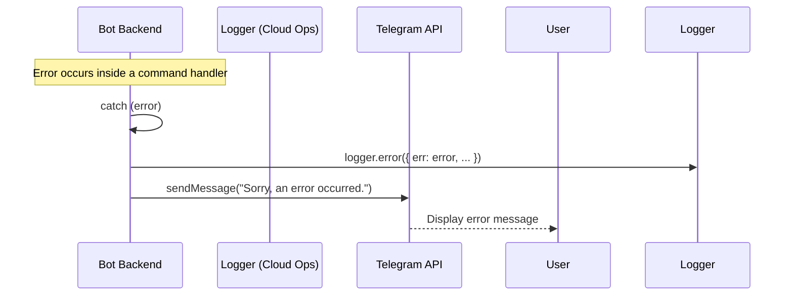

# Section 18: Error Handling Strategy

### Error Flow
This diagram shows the flow when an unexpected error occurs in the Bot Backend.


### Error Format

**Logged Error Format (JSON):**
We will use a structured logger (`pino`) to produce JSON logs that can be easily searched and analyzed in Google Cloud Logging.
```typescript
interface LoggedError {
  level: 'error';
  time: string;
  pid: number;
  hostname: string;
  err: {
    type: string; // e.g., 'Error'
    message: string;
    stack: string;
  };
  msg: string; // A human-readable summary of the error context
}
```

**User-Facing Error Format:**
User-facing errors will be simple, non-technical strings sent via Telegram.
> "_Sorry, something went wrong while processing your request. The team has been notified. Please try again in a few moments._"

### Frontend Error Handling
The "frontend" is the native Telegram client. We have no control over its error handling (e.g., for network connectivity issues). Our responsibility is to ensure the bot provides a clear response if an error occurs on the backend.

### Backend Error Handling

**Bot Backend (`telegraf` handler):**
All asynchronous handlers must be wrapped in a `try...catch` block.
```typescript
bot.command('stats', async (ctx) => {
  try {
    // ... logic that might fail ...
    await ctx.reply('Success!');
  } catch (error) {
    logger.error({ err: error, msg: 'Failed to handle /stats command' });
    await ctx.reply('Sorry, something went wrong.');
  }
});
```

**VM Agent (Pub/Sub listener):**
The agent's subscription listeners must also be robust. For critical errors like a lost connection to Pub/Sub, a retry mechanism with exponential backoff should be implemented.
```typescript
subscription.on('error', (error) => {
  logger.error({ err: error, msg: 'Pub/Sub subscription error' });
  // Implement retry logic here
});

subscription.on('message', (message) => {
  try {
    // ... process message ...
    message.ack();
  } catch (error) {
    logger.error({ err: error, msg: 'Failed to process message' });
    // message.nack() to have Pub/Sub redeliver it later
  }
});
```
