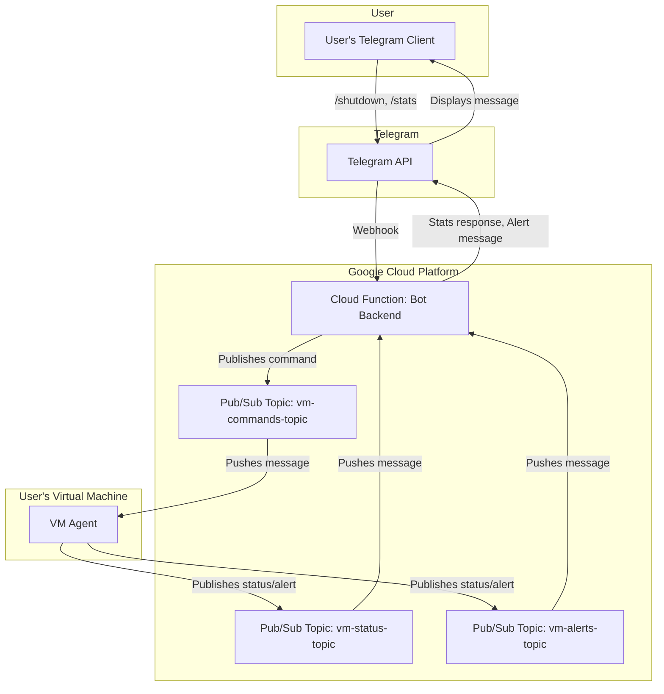

# Section 2: High Level Architecture

### Technical Summary
The architecture for VM Sentinel is a decoupled, event-driven system designed for security and minimal resource overhead. It consists of a Node.js **VM agent** running on the target Debian machine, which communicates asynchronously with a serverless **Telegram bot backend** via a **Google Cloud Pub/Sub** message bus. The backend, hosted on Google Cloud Functions, processes user commands and relays them securely to the agent. This design avoids exposing any inbound ports on the user's VM, directly achieving the core security and "effortless control" goals from the PRD.

### Platform and Infrastructure Choice
**Platform:** Google Cloud Platform (GCP)
**Key Services:**
*   **Google Cloud Functions:** For hosting the serverless, stateless bot backend.
*   **Google Cloud Pub/Sub:** To act as the secure, asynchronous message bus between the agent and the bot.
*   **Google IAM:** For securely managing credentials for the VM agent.
**Deployment Host and Regions:** The Cloud Function will be deployed to a region like `us-central1` to start. This can be configured based on user location for lower latency if needed in the future.

### Repository Structure
**Structure:** Monorepo
**Monorepo Tool:** npm Workspaces
**Package Organization:** The repository will contain an `packages` directory with two primary packages:
*   `packages/agent`: The Node.js application for the VM agent
*   `packages/bot`: The Node.js application for the Telegram bot backend (Cloud Function).
This aligns with PRD Story 1.1 and simplifies dependency management and code sharing.

### High Level Architecture Diagram

### Architectural Patterns
- **Serverless Architecture:** The bot backend is a serverless function, eliminating the need for server management and reducing cost. _Rationale:_ Aligns with the project's goal of being a lightweight, low-overhead utility.
- **Event-Driven Architecture:** Components communicate through events (messages) on the Pub/Sub bus, decoupling them completely. _Rationale:_ This is critical for security (no open ports) and resilience (components don't need to be online simultaneously).
- **Agent-Based Monitoring:** A local agent performs monitoring on the host system. _Rationale:_ This is the only way to get detailed, real-time system information like input device usage and screen content.
- **Message Bus Integration:** Using Pub/Sub as a central message broker. _Rationale:_ Provides a scalable, reliable, and secure communication channel that forms the backbone of the entire system.
