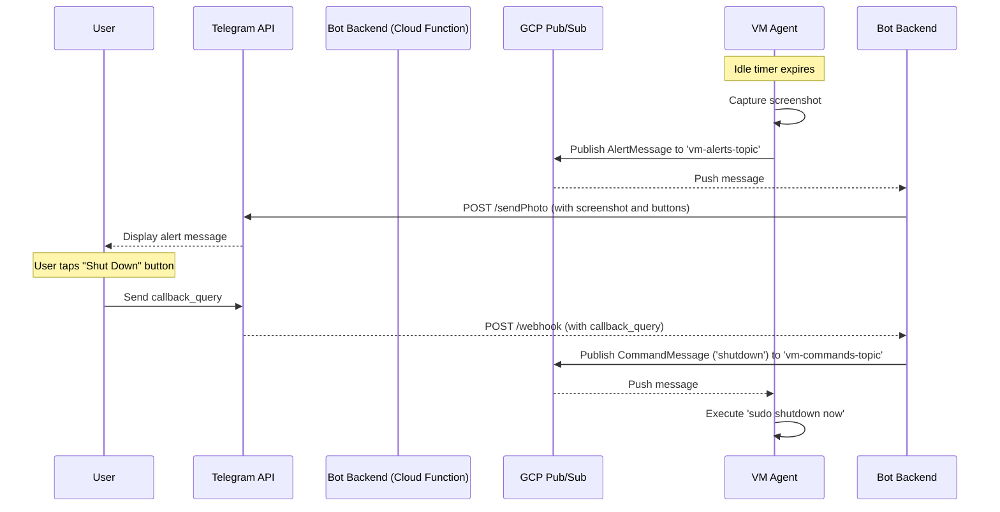

# Section 8: Core Workflows

### Idle Alert and Remote Shutdown Workflow

```mermaid
sequenceDiagram
    participant User
    participant Telegram API
    participant Bot Backend (Cloud Function)
    participant GCP Pub/Sub
    participant VM Agent

    Note over VM Agent: Idle timer expires
    VM Agent->>VM Agent: Capture screenshot
    VM Agent->>GCP Pub/Sub: Publish AlertMessage to 'vm-alerts-topic'
    GCP Pub/Sub-->>Bot Backend: Push message
    
    Bot Backend->>Telegram API: POST /sendPhoto (with screenshot and buttons)
    Telegram API-->>User: Display alert message
    
    Note over User: User taps "Shut Down" button
    User->>Telegram API: Send callback_query
    Telegram API-->>Bot Backend: POST /webhook (with callback_query)
    
    Bot Backend->>GCP Pub/Sub: Publish CommandMessage ('shutdown') to 'vm-commands-topic'
    GCP Pub/Sub-->>VM Agent: Push message
    
    VM Agent->>VM Agent: Execute 'sudo shutdown now'
```
